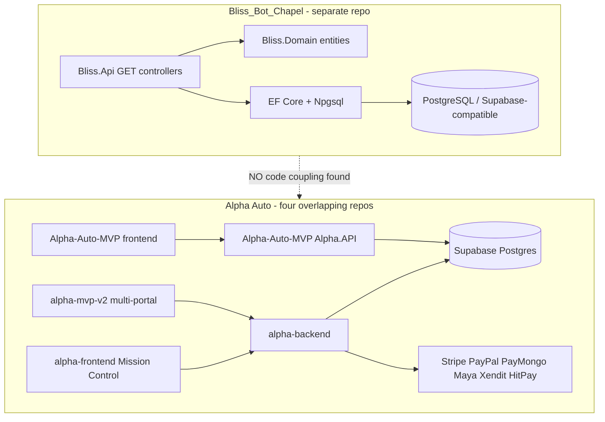

# Current architecture (as implemented today)

Do not mix with the target map (`target-architecture.md`).

## System landscape (actual)



## Bliss internal (actual)

```
Bliss.Api
  └── Controllers (read-only DTO mapping)
        └── BlissDbContext
              └── Configurations (Restrict FKs, non-unique indexes)
                    └── PostgreSQL tables

Phase1DataSeeder (Development startup if connection works)
Bliss.Tests (InMemory architecture proofs)
```

There is **no** Fishing Fleet, Officiant scorer, Chaperone engine, Ad delivery runtime, measurement pipeline, financial ledger, or Economics rate engine in Bliss.

Economics is a **separate bounded context** (`docs/economics/`). Phases
1–3 persist market reference data, creator audience/performance
snapshots, market/industry profiles, inventory benchmarks, and dated FX
observations with GET-only operator visibility. Rate
recommendations, quotes, and later Economics phases remain unimplemented.

`MatchEvaluationRun` is an empty-capable table for later history. It does **not** run algorithms.

`Campaign` / `CampaignPlacement` store rows. They do **not** assign creators, approve, track, or complete campaigns.

## Alpha Auto internal (actual)

Automotive commerce: Users, Orders, Products, Drivers, Mechanics, Payments, Settlements, Referrals, Entrepreneur earnings.

**Not** a media/ad-tech stack. Referral “community builder” is **not** a Bliss Creator.

## Database / entity map — Bliss

All Bliss domain PKs are `uuid`. Delete behavior on major FKs: `ON DELETE RESTRICT`.

| Concept | Exists? | Table / entity | PK | Important FKs | Relationships | Status | Tests | Notes |
| --- | --- | --- | --- | --- | --- | --- | --- | --- |
| Creator | YES | `Creators` / `Creator` | `Id` | — | 1:N platforms, content, matches | 🟡 schema+API GET | Persistence + API route | Demographics nullable |
| Creator Platform | YES | `CreatorPlatforms` | `Id` | `CreatorId` | N:1 Creator | 🟡 | Via seed/detail DTO | `ExternalProfileId` |
| Content Item | YES | `ContentItems` | `Id` | `CreatorId` | 1:N slots | 🟡 | ARCH-001 | `ExternalContentId` |
| Ad Inventory Slot | YES | `AdInventorySlots` | `Id` | `ContentItemId` | 1:N placements | 🟡 | ARCH-002 | String `SlotType` |
| Audience Profile | NO as entity | fields on `Creator` | — | — | — | 🟡 PARTIAL | Unknown% test | No separate profile table |
| Creator Metrics | NO | — | — | — | — | ❌ | — | Followers on platform only |
| Geography | PARTIAL | `CountryCode`, `PrimaryGeography`, `MarketCountryCode` | — | — | — | 🟡 strings | Seed PH/Manila | Not a geo engine |
| Language | PARTIAL | `PrimaryLanguage`, opportunity `Language` | — | — | — | 🟡 strings | Seed | Not i18n |
| Data Provenance | YES | `DataProvenances` | `Id` | polymorphic `EntityId` | No FK constraint | 🟡 | Provenance test | No dedicated API |
| Advertiser | YES | `Advertisers` | `Id` | — | 1:N programs | 🟡 GET | Seed | |
| Advertiser Program | YES | `AdvertiserPrograms` | `Id` | `AdvertiserId` | 1:N opportunities | 🟡 GET | Seed | |
| Advertiser Opportunity | YES | `AdvertiserOpportunities` | `Id` | `AdvertiserProgramId` | 1:N matches | 🟡 GET | Seed | |
| Affiliate Network | YES | `AffiliateNetworks` | `Id` | — | via NetworkAccess | 🟡 no list API | Seed | |
| Network Access | YES | `NetworkAccesses` | `Id` | `AdvertiserId`, `AffiliateNetworkId` | Independent of ProgramAccess | 🟡 | AccessIndependenceTests | |
| Program Access | YES | `ProgramAccesses` | `Id` | `AdvertiserProgramId` | Independent | 🟡 | same | |
| Eligibility Check | YES | `EligibilityChecks` | `Id` | `BlissMatchId` | Storage only | 🟡 placeholder | Nested match API | No Chaperone logic |
| Bliss Match | YES | `BlissMatches` | `Id` | `CreatorId`, `AdvertiserOpportunityId`, `RuleVersionId` | 1:N scores, eligibility | 🟡 | ARCH-003/004 | Scores nullable |
| Match Score Component | YES | `MatchScoreComponents` | `Id` | `BlissMatchId` | Storage only | 🟡 | Nested API | No Officiant |
| Rule Version | YES | `RuleVersions` | `Id` | — | Matches restrict-delete | 🟡 GET | HIST tests | No rule payload JSON |
| Human Review | NO | — | — | — | — | ❌ | — | |
| Campaign | YES | `Campaigns` | `Id` | — | 1:N placements | 🟡 no API | Placement test | No dates/advertiser |
| Campaign Placement | YES | `CampaignPlacements` | `Id` | `CampaignId`, `ContentItemId`, `AdInventorySlotId` | No BlissMatchId | 🟡 no API | MULTI-002 | |
| MatchEvaluationRun | YES | `MatchEvaluationRuns` | `Id` | `CreatorId`, `RuleVersionId` | Unused by API/seeder | 🟡 DECLARED | Untested usage | Not an engine |
| Tracking | NO | — | — | — | — | ❌ | — | |
| Transaction / Ledger / Payable / Alpha Revenue | NO in Bliss | Alpha Auto has order finance | — | — | — | ❌ Bliss / 🟡 Auto | Auto untested | Different product |
| Economics / rate intelligence | PHASES 1–3 INPUT DATA | Ten EF tables + `api/economics` GETs | uuid | Inputs → creator/content/market/model/source | 🟡 no engine | Persistence/API/UI tests | Recommendations and quotes absent |

## Bliss Phase 1 concept audit (re-verified in source, not from prior chat)

| Concept | Gate |
| --- | --- |
| Creators | ✅ Exists and functional (persist + GET). Incomplete: no write API, no auth. |
| CreatorPlatforms | 🟡 Nested on creator detail; no list endpoint |
| ContentItems | ✅ GET + slots nested |
| AdInventorySlots | ✅ Nested; no standalone controller |
| Advertisers / Programs / Opportunities | ✅ GET lists |
| AffiliateNetworks / NetworkAccesses / ProgramAccesses | 🟡 Tables + seed; no dedicated GET |
| RuleVersions | ✅ GET |
| BlissMatches | ✅ GET including Match A vs B distinct opportunities |
| MatchScoreComponents / EligibilityChecks | 🟡 Nested; placeholder values |
| DataProvenances | 🟡 Table + seed; no API |
| Campaigns / CampaignPlacements | 🟡 Persist; no API |
| MatchEvaluationRuns | 🟡 Table only |

Indexes: FKs indexed; CreatorId and ContentItemId **not unique**. Delete: Restrict on major FKs.

## Alpha Auto finance (do not treat as Bliss ledger)

Exists in `alpha-backend`: `payments`, `order_financials`, `settlement_queue`, `tax_ledger_entries`, `supplier_payouts`, `driver_payouts`, `entrepreneur_earnings`. Bound to **auto parts orders**, not Bliss matches.
