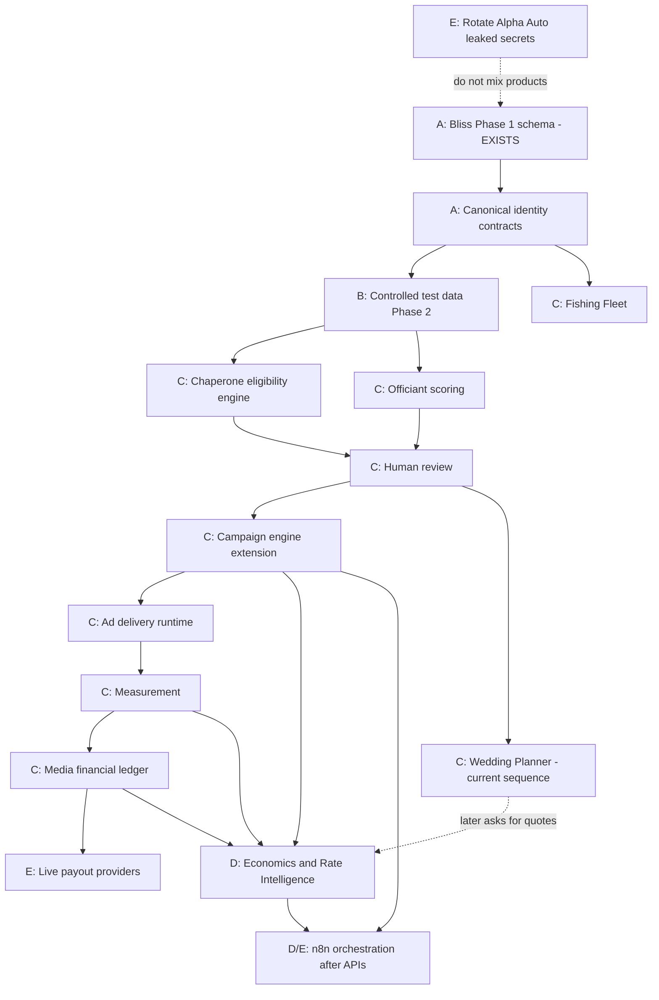

# Dependency map

## Classification key

- **A — FOUNDATION** — must exist before dependents
- **B — PARALLEL SAFE** — after contracts
- **C — DEPENDENT**
- **D — LATER**
- **E — BLOCKED** — external/legal/secrets/business

## Graph (Bliss / Alpha media platform)

## Component list

| Component | Class | Depends on | Notes |
| --- | --- | --- | --- |
| Bliss Phase 1 foundation | A (done) | — | Keep; do not rebuild |
| HTTP/Postgres verification tests | B | P1 | Safe |
| Documentation / matrices | B | — | This mission |
| Canonical Creator identity docs | A | P1 | External IDs already exist as strings |
| Phase 2 controlled test data | C | Phase 2 **engineering contract** | User previously froze Phase 2 until contract |
| Chaperone | C | RuleVersion payload + data | |
| Officiant | C | Weights in RuleVersion; never AI-as-authority | |
| Fishing Fleet | C | Identity + provenance contracts | Global, not per-country tables |
| Human review | C | Match + eligibility outputs | |
| Campaign FKs to Match | C | Product decision | Additive migration |
| Wedding Planner Phases 1–9 | C | Accepted WP contracts | Must not invent prices |
| Economics & Rate Intelligence | D | Phase 1 reference foundation exists; engine needs matching + inventory + later WP quote need | Separate bounded context; later phases gated |
| Ad delivery | C | Slots + placements | Not the Auto website |
| Measurement | C | Placement IDs | Feeds historical economics later |
| Media ledger | C | Measurement + finance design | **Not** Auto order ledger; separate from market-value calc |
| Wise/PayPal live money | E | Legal, KYC, ledger | |
| Affiliate network live APIs | E / D | Contracts | |
| n8n | D | Stable APIs | Unknown hosted workflows |
| Alpha Auto security hardening | E | Owner rotation | **STOP until done** |
| Merge Bliss into Alpha Auto | E | Explicit architecture decision | Not recommended in Mission 001 |

## Parallel-safe after contracts (not before)

- Bliss documentation and additive tests
- RuleVersion **document** (JSON schema) without executing scores
- UI wireframes for review queue (no production auth change)
- Inventory of hosted n8n (export workflows) — if access granted

## Sequential

1. Secret rotation (Alpha Auto)  
2. Keep Bliss Phase 1  
3. Phase 2 contract → test data  
4. Chaperone then Officiant (or parallel **after** shared RuleVersion contract)  
5. Campaign/delivery/measurement/ledger
6. Economics & Rate Intelligence (after current Wedding Planner sequence, or when a dedicated quote contract is issued)
