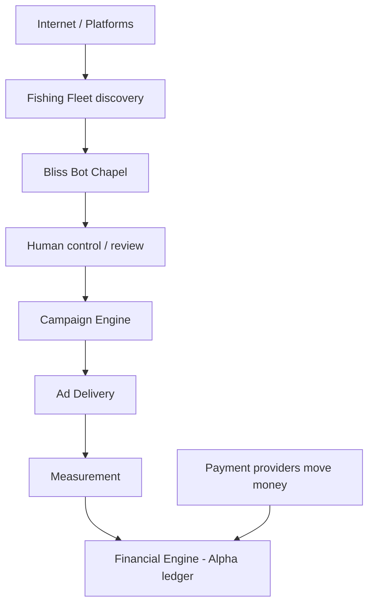

# Target architecture (desired — not claimed as built)

This is the **intended** Alpha Global Media / Bliss platform. It is **not** the current codebase.

## Target pipeline

## Where current components fit

| Target stage | What exists today | Gap |
| --- | --- | --- |
| Internet / Platforms | ExternalProfileId / URL strings on CreatorPlatform | No crawlers |
| Fishing Fleet | MISSING | Entire subsystem |
| Bliss Bot Chapel | Phase 1 **schema + read API + tests** | Chaperone, Officiant, write workflows |
| Human control | MISSING in Bliss; Alpha Auto has role-verification for **auto** users | Media review queue |
| Campaign Engine | Campaign + Placement **rows** | No match reference, approval, dates, creatives |
| Ad Delivery | Slot types PRE/MID/POST/LOWER_THIRD as **data** | No renderer/runtime; overlay types missing |
| Measurement | MISSING | Entire subsystem |
| Financial Engine | Alpha Auto **order** ledger | Must not be reused as media ledger without a new bounded context |

## Missing connections (current)

- No Fishing Fleet → Creator ingest
- CampaignPlacement does not reference BlissMatch
- Campaign does not reference Advertiser/Opportunity
- EligibilityCheck is not evaluated
- MatchScoreComponent is not calculated
- No measurement → ledger posting
- Bliss repo ↛ Alpha Auto repo

## Design rules for later missions

- Countries/languages/currencies = **data/configuration**, not per-country tables.
- Payment providers ≠ Alpha financial meaning.
- n8n = orchestration; Alpha/Bliss DB = business truth.
- Do not merge Alpha Auto order domain into Bliss tables.
- Do not delete Bliss Phase 1 entities to “start over.”
